# IBM Back-end Application Development Capstone: Main Django Application


This repository contains the core Django application for the IBM Back-end Application Development Capstone Project, the final course in the [IBM Back-End Development Professional Certificate](https://www.coursera.org/professional-certificates/ibm-backend-development) on Coursera. It integrates microservices for pictures and songs, manages user authentication, concert bookings, and deployments using cloud-native technologies.

## Project Overview

The main application handles user interactions, including viewing events, songs, pictures, and managing registrations. It connects to two microservices for data retrieval.
- Anonymous users: View pictures and songs.
- Signed-in users: Book concerts, view registrations.
- Admin: Manage concert details.

This is **Part 3** of the capstone project (integration and deployment). For supporting components:
- [Back-End-Development-Pictures](https://github.com/HossamJa/Back-End-Development-Pictures): Part 1 - Pictures Microservice.
- [Back-End-Development-Songs](https://github.com/HossamJa/Back-End-Development-Songs): Part 2 - Songs Microservice.

## Accomplishments in This Module

Completed in Module 3: Main Django Application and Module 4: Deployment.
- Created data models, migrations, and views for concerts, photos, songs.
- Implemented user authentication (signup, login, logout).
- Integrated with microservices via API calls.
- Deployed to IBM Kubernetes Service, Code Engine, and OpenShift.
- Evidence screenshots (insert below):

  **Django Migrate**
  - 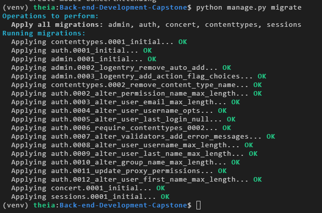

  **Django App in Browser**
  - 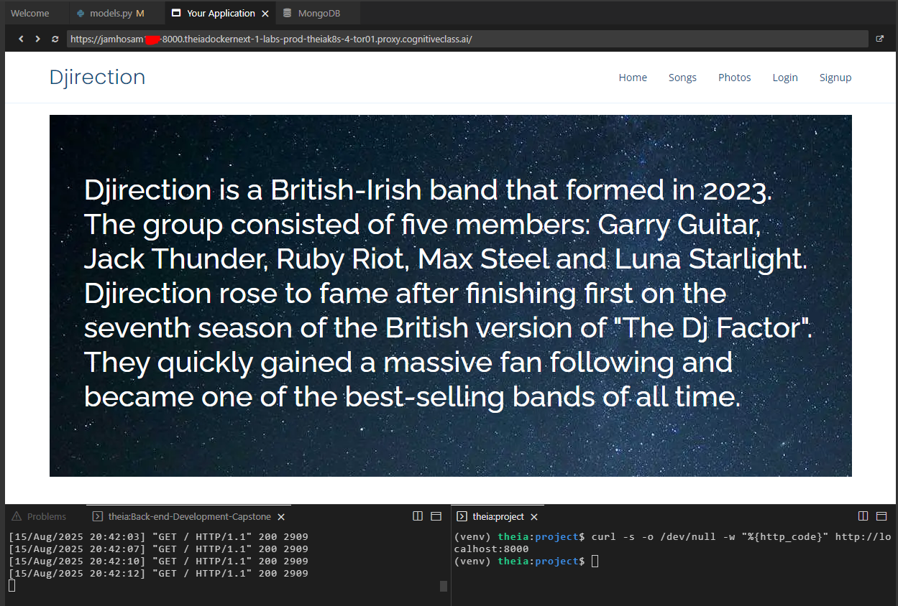

  **Song Modal**
  - 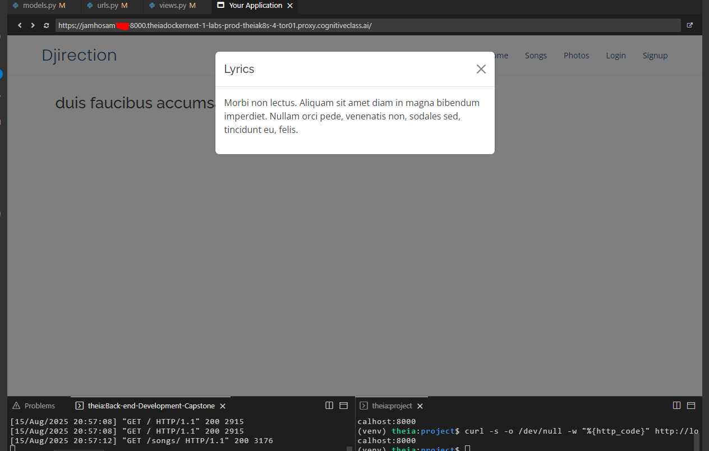

  **Photos Page**
  - 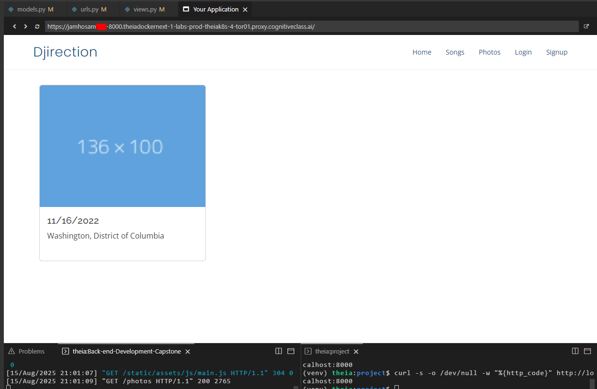

  **Songs and Photos Migrate**
  - 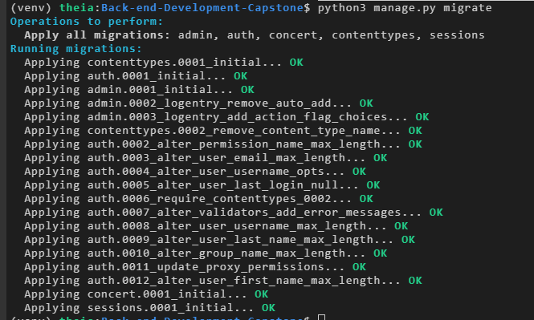
  
### Deployment:

   **Docker Build]**
  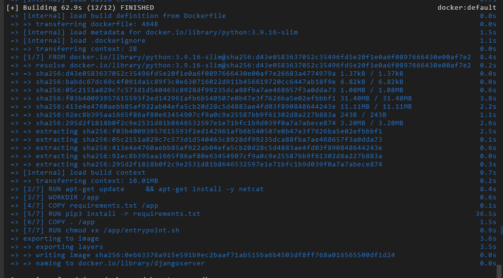

  **Kubectl Apply**
  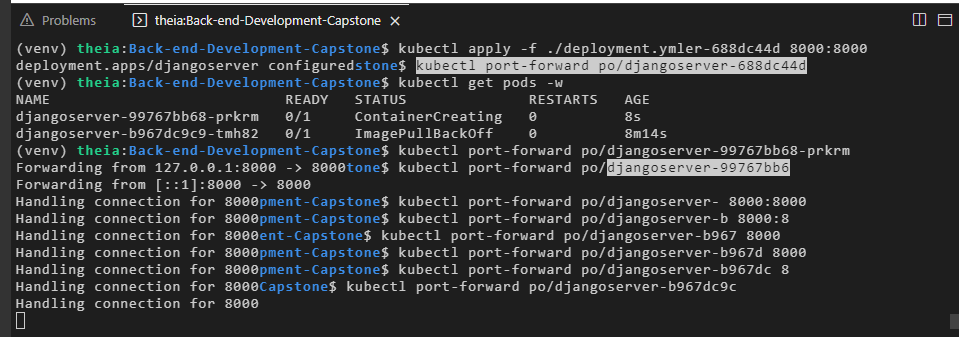

  **Main App in Browser**
  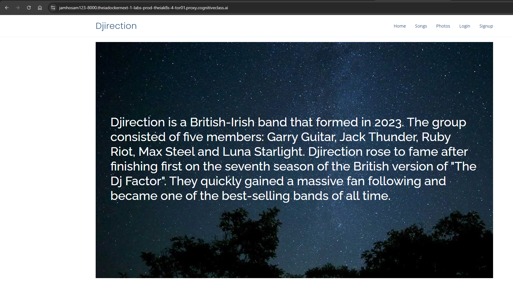

  **Songs Page Deployed**
  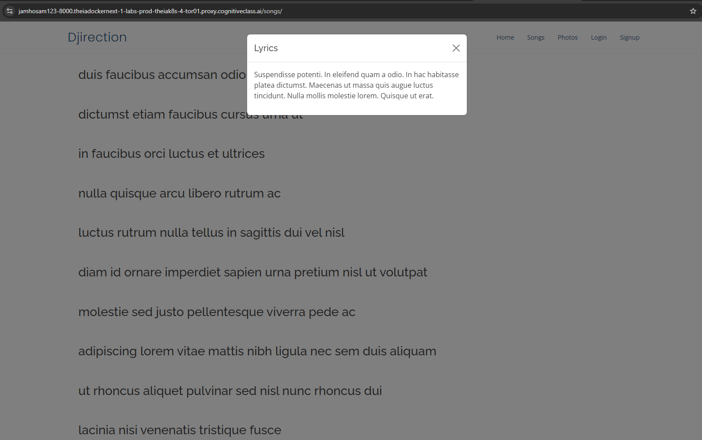

  **Pictures Page Deployed**
  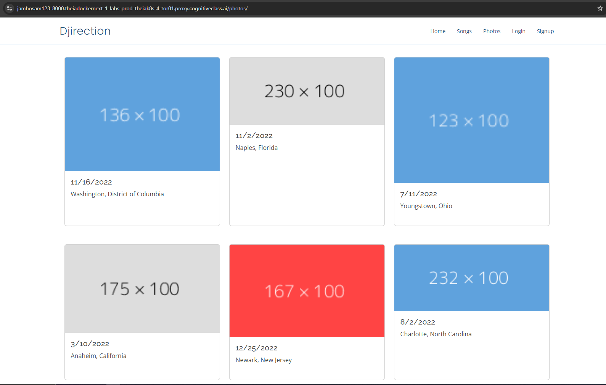

  **Admin Login**
  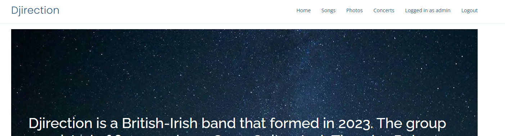

  **Concerts Page**
  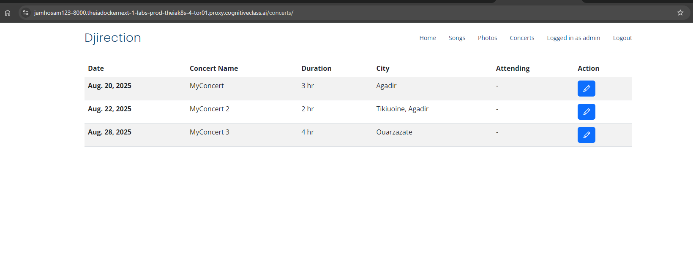

## Technologies Used

- **Framework**: Django for web application.
- **Databases**: SQLite (local), MongoDB (via microservice).
- **DevOps**: Docker, Kubernetes (IBM IKS), OpenShift, IBM Code Engine.

## Installation and Setup

1. Clone the repository:
   ```
   git clone https://github.com/HossamJa/Back-end-Development-Capstone.git
   ```
2. Navigate to the directory:
   ```
   cd Back-end-Development-Capstone
   ```
3. Set up the environment:
   ```
   bash ./bin/setup.sh
   ```
4. Install dependencies:
   ```
   pip install -r requirements.txt
   ```
5. Run migrations:
   ```
   python manage.py makemigrations
   python manage.py migrate
   ```
6. Run the server:
   ```
   python manage.py runserver
   ```

## Deployment

- Containerize: Complete Dockerfile and build image.
- Deploy to IBM Kubernetes Service using `deployment.yml`.
- Connect to deployed microservices for full functionality.

## License

Licensed under the Apache License 2.0 - see the [LICENSE](LICENSE) file for details.

## Acknowledgments

- IBM and Coursera for the Back-End Development Professional Certificate.
